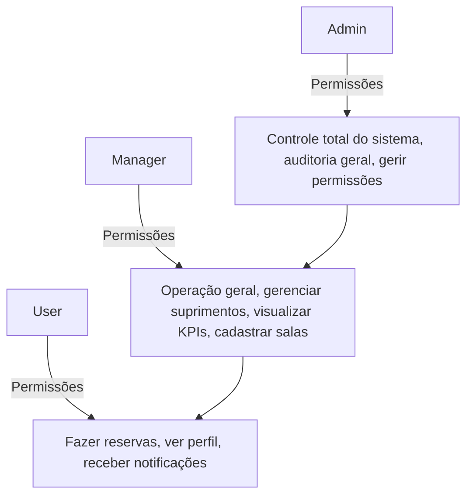
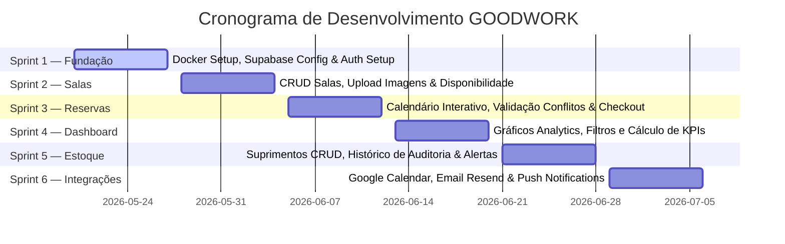

# GOODWORK 🚀

> **Plataforma SaaS Premium de Gerenciamento de Coworking**
> 
> Uma solução ponta a ponta focada em agendamento inteligente de salas, gestão operacional de suprimentos, KPIs gerenciais avançados, automação de notificações, integração nativa com Google Calendar e uma experiência de usuário (UX/UI) moderna e premium.

---

## 📌 Visão Executiva e Recursos Core
- 📅 **Agendamento inteligente de salas** com prevenção de conflitos em tempo real.
- ⚙️ **Gestão operacional e controle de suprimentos** com histórico de auditoria.
- 📊 **Dashboard gerencial** com KPIs operacionais, financeiros e de estoque.
- 🔔 **Automação de notificações** multicanal (Push, E-mail, Realtime).
- 🗓️ **Integração bidirecional com Google Calendar**.
- 💎 **Interface Premium & Responsiva** desenvolvida com atenção milimétrica aos detalhes visuais (Pixel-Oriented).

---

## 🛠️ 1. Arquitetura Geral do Sistema

### 1.1 Stack Principal

| Camada | Tecnologia | Objetivo |
| :--- | :--- | :--- |
| **Frontend** | React 18 + Vite | SPA responsiva de alta performance |
| **Backend** | Next.js 14 | APIs robustas + Server-Side Rendering (SSR) |
| **Banco de Dados** | PostgreSQL (Supabase) | Persistência de dados relacional e segura |
| **Autenticação** | Supabase Auth | Autenticação JWT + Integração OAuth |
| **ORM / Query** | Supabase SDK | Integração otimizada com o banco de dados |
| **Estado** | React Query | Gerenciamento de cache e server-state |
| **Estilização UI** | TailwindCSS | Estilização utilitária moderna e responsiva |
| **Realtime** | Supabase Realtime | Sincronização e atualizações instantâneas ao vivo |
| **Disparos de E-mail** | Resend | Envio confiável de notificações por e-mail |
| **Infraestrutura** | Docker | Padronização e isolamento do ambiente de desenvolvimento |

---

## 📂 2. Estrutura do Projeto (Sugestão Monorepo)

O projeto está estruturado em um formato Monorepo para facilitar o compartilhamento de tipos, utilitários e a gestão dos serviços de frontend e backend.

```text
goodwork/
├── apps/
│   ├── frontend/         # React 18 + Vite SPA
│   └── backend/          # Next.js 14 API & SSR Services
├── packages/
│   ├── ui/               # Componentes compartilhados e Design System
│   ├── types/            # Tipagens globais TypeScript
│   └── utils/            # Funções utilitárias compartilhadas
├── infra/
│   ├── docker/           # Arquivos de configuração de containers (Postgres, etc.)
│   └── nginx/            # Proxy reverso / Web Server config
├── docs/                 # Documentação adicional de suporte
└── assets/               # Imagens de salas, logos e guias visuais
```

---

## 💾 3. Estrutura Completa do Banco de Dados

### 3.1 Tabela: `users`
Armazena todos os usuários da plataforma e define seus níveis de permissão (Roles/ACL).

| Campo | Tipo | Regras / Detalhes |
| :--- | :--- | :--- |
| `id` | `uuid` | **Primary Key** |
| `name` | `varchar(150)` | Obrigatório |
| `email` | `varchar(255)` | Único, Obrigatório |
| `password_hash` | `text` | Nullable (para logins via OAuth/Supabase Auth) |
| `role` | `enum` | `admin` \| `manager` \| `user` |
| `phone` | `varchar(20)` | Opcional |
| `avatar_url` | `text` | Opcional |
| `active` | `boolean` | Default `true` |
| `created_at` | `timestamp` | Automático |
| `updated_at` | `timestamp` | Automático |

### 3.2 Tabela: `rooms`
Cadastro das salas físicas de coworking disponíveis para agendamento.

| Campo | Tipo | Regras / Detalhes |
| :--- | :--- | :--- |
| `id` | `uuid` | **Primary Key** |
| `name` | `varchar(120)` | Nome descritivo da sala |
| `description` | `text` | Detalhes físicos da sala |
| `capacity` | `integer` | Capacidade máxima de pessoas |
| `hourly_rate` | `decimal` | Valor da hora para agendamento |
| `image_url` | `text` | URL da foto da sala (obrigatório imagens premium/reais) |
| `amenities` | `jsonb` | Facilidades disponíveis (Ver estrutura abaixo) |
| `active` | `boolean` | Default `true` |
| `created_at` | `timestamp` | Automático |

#### Exemplo de Estrutura JSON no campo `amenities`:
```json
[
  "tv",
  "wifi",
  "videoconferencia",
  "quadro",
  "cafeteira"
]
```

### 3.3 Tabela: `bookings`
Controle de agendamentos e status das salas físicas.

| Campo | Tipo | Regras / Detalhes |
| :--- | :--- | :--- |
| `id` | `uuid` | **Primary Key** |
| `room_id` | `uuid` | **Foreign Key** apontando para `rooms.id` |
| `user_id` | `uuid` | **Foreign Key** apontando para `users.id` |
| `start_time` | `timestamp` | Início do período agendado |
| `end_time` | `timestamp` | Fim do período agendado |
| `total_price` | `decimal` | Preço total calculado da reserva |
| `status` | `enum` | `pending` \| `confirmed` \| `canceled` \| `finished` |
| `notes` | `text` | Observações adicionais do solicitante |
| `created_at` | `timestamp` | Automático |

### 3.4 Tabela: `supplies`
Controle de estoque operacional das facilidades do coworking.

| Campo | Tipo | Regras / Detalhes |
| :--- | :--- | :--- |
| `id` | `uuid` | **Primary Key** |
| `name` | `varchar` | Nome do insumo (ex: Café, Papel A4, Copos) |
| `category` | `varchar` | Categoria do suprimento |
| `quantity` | `integer` | Quantidade atual em estoque |
| `min_threshold` | `integer` | Limite mínimo (dispara alertas se `quantity < min_threshold`) |
| `reorder_quantity`| `integer` | Quantidade padrão para reposição recomendada |
| `unit` | `varchar` | Unidade de medida (ex: kg, un, pct) |
| `active` | `boolean` | Default `true` (Soft Delete) |
| `created_at` | `timestamp` | Automático |

### 3.5 Tabela: `supply_history`
Auditoria completa de qualquer alteração na tabela de suprimentos.

| Campo | Tipo | Regras / Detalhes |
| :--- | :--- | :--- |
| `id` | `uuid` | **Primary Key** |
| `supply_id` | `uuid` | **Foreign Key** apontando para `supplies.id` |
| `action` | `enum` | Tipo de movimentação de estoque |
| `quantity_before` | `integer` | Quantidade no estoque antes da ação |
| `quantity_after` | `integer` | Quantidade no estoque após a ação |
| `performed_by` | `uuid` | **Foreign Key** apontando para `users.id` |
| `created_at` | `timestamp` | Automático |

### 3.6 Tabela: `notifications`
Central de notificações para o usuário final e managers.

| Campo | Tipo | Regras / Detalhes |
| :--- | :--- | :--- |
| `id` | `uuid` | **Primary Key** |
| `user_id` | `uuid` | **Foreign Key** apontando para `users.id` |
| `type` | `enum` | Categoria (ex: `booking`, `supply`, `general`) |
| `title` | `varchar` | Título da notificação |
| `message` | `text` | Texto/Corpo da mensagem |
| `read` | `boolean` | Status de leitura (Default `false`) |
| `metadata` | `jsonb` | Informações de contexto extras (ex: `booking_id`) |
| `created_at` | `timestamp` | Automático |

### 3.7 Tabela: `audit_logs`
Logs de auditoria de alterações cruciais no sistema para fins de conformidade.

| Campo | Tipo | Regras / Detalhes |
| :--- | :--- | :--- |
| `id` | `uuid` | **Primary Key** |
| `entity` | `varchar` | Entidade afetada (ex: `bookings`, `rooms`) |
| `entity_id` | `uuid` | ID do registro alterado |
| `action` | `varchar` | Operação executada (ex: `UPDATE`, `DELETE`) |
| `old_data` | `jsonb` | Payload anterior à modificação |
| `new_data` | `jsonb` | Payload pós modificação |
| `performed_by` | `uuid` | **Foreign Key** apontando para `users.id` |
| `created_at` | `timestamp` | Automático |

---

## 🧠 4. Regras de Negócio Fundamentais

### 4.1 Reservas
1. **Duração Mínima:** O intervalo mínimo para qualquer reserva é de **30 minutos**.
2. **Duração Máxima:** O tempo máximo contínuo permitido de reserva por sala é de **8 horas**.
3. **Antecedência Máxima:** Reservas só podem ser criadas com no máximo **30 dias de antecedência**.
4. **Cancelamento:** Permitido sem penalidades/bloqueios até **2 horas antes** do horário de início programado.
5. **Horários de Pico:** Aplicação automática de tarifas diferenciadas (preço diferenciado).
6. **Conflito de Reservas:** Expressamente **não permitido**.

#### Algoritmo de Prevenção de Conflitos:
Uma reserva desejada (`[start_time, end_time]`) é considerada **inválida** se colidir com qualquer reserva existente na mesma sala através da seguinte lógica:
$$\text{start\_time} < \text{existing\_end} \quad \text{AND} \quad \text{end\_time} > \text{existing\_start}$$

### 4.2 Controle de Estoque de Suprimentos
- **Disparo de Alertas:** Se a quantidade atual de um insumo cair abaixo do limite mínimo definido (`quantity < min_threshold`), um alerta automático é gerado no sistema e enviado aos managers.
- **Deleção Segura:** A exclusão de suprimentos deve utilizar **Soft Delete** (`active = false`).
- **Histórico Obrigatório:** Toda e qualquer alteração de estoque (entrada, saída, correção) deve gerar um registro detalhado na tabela `supply_history` contendo o ID do usuário que efetuou a movimentação.

### 4.3 Controle de Acesso (ACL & Roles)



---

## 🌐 5. Endpoints de API (Arquitetura REST)

### 5.1 Autenticação (`/api/auth`)
* `POST /api/auth/login` - Login do usuário (Geração de JWT + Cookies seguros).
* `POST /api/auth/register` - Cadastro de novos usuários.
* `POST /api/auth/logout` - Revogação de tokens e encerramento de sessão.
* `POST /api/auth/refresh` - Renovação automática do token expirado através de Refresh Token.

### 5.2 Salas (`/api/rooms`)
* `GET /api/rooms` - Lista todas as salas disponíveis e ativas.
* `GET /api/rooms/:id` - Detalha uma sala específica.
* `POST /api/rooms` - Cadastro de nova sala *(Manager/Admin)*.
* `PUT /api/rooms/:id` - Atualização dos dados da sala *(Manager/Admin)*.
* `DELETE /api/rooms/:id` - Inativação da sala (Soft Delete) *(Manager/Admin)*.

### 5.3 Reservas (`/api/bookings`)
* `GET /api/bookings` - Lista reservas filtradas por usuário, sala ou período.
* `POST /api/bookings` - Criação de reserva (Com validação rígida de conflitos).
* `PUT /api/bookings/:id` - Atualização/Modificação de reserva.
* `DELETE /api/bookings/:id` - Cancelamento da reserva (Com validação das 2h de antecedência).

### 5.4 Suprimentos (`/api/supplies`)
* `GET /api/supplies` - Lista os insumos operacionais cadastrados.
* `POST /api/supplies` - Cadastro de novos itens de estoque *(Manager/Admin)*.
* `PUT /api/supplies/:id` - Entrada/Saída ou correção de quantidades *(Manager/Admin)*.
* `DELETE /api/supplies/:id` - Inativação de suprimento *(Manager/Admin)*.

---

## 📈 6. Dashboard Gerencial & KPIs

### 6.1 Indicadores Operacionais e Financeiros
- **Taxa de Ocupação:** Mede o quão produtivas estão as salas físicas.
  $$\text{Taxa de Ocupação} = \frac{\text{Horas Efetivamente Reservadas}}{\text{Horas Disponíveis no Período}}$$
- **Receita por Sala:** Faturamento individualizado por espaço.
  $$\text{Receita Sala} = \sum \text{Valor das Reservas Confirmadas}$$
- **Ticket Médio:** Valor médio gasto por reserva no coworking.
  $$\text{Ticket Médio} = \frac{\text{Receita Total}}{\text{Total de Reservas Realizadas}}$$
- **Taxa de Cancelamento:** Proporção de agendamentos cancelados.
  $$\text{Taxa de Cancelamento} = \frac{\text{Reservas Canceladas}}{\text{Total de Reservas Solicitadas}}$$

### 6.2 Indicadores de Estoque (Suprimentos)
- **Itens Críticos:** Quantidade de suprimentos atualmente abaixo do `min_threshold`.
- **Consumo Médio:** Cálculo de vazão mensal de suprimentos.
- **Previsão de Ruptura:** Estimativa matemática de quando o estoque zerará com base no histórico de consumo médio diário.
- **Reposições do Mês:** Frequência e volume total de reposições de insumos registradas pelos operadores.

---

## 🎨 7. Diretrizes de UI/UX, Assets Visuais e Fidelidade Visual

### 7.1 Utilização Obrigatória de Imagens Reais de Salas
Durante todo o desenvolvimento do frontend, **não é permitida a utilização de placeholders genéricos**. A interface deve utilizar **imagens reais, limpas e de padrão corporativo moderno** para ilustrar as salas de reunião.

- **Resolução mínima:** 1280x720 (proporção 16:9 preferencial).
- **Formatos sugeridos:** JPG de alta qualidade ou WebP otimizado.
- **Estrutura recomendada de assets:**
  ```text
  assets/
  └── rooms/
      ├── room-01/
      │   ├── cover.webp
      │   ├── gallery-1.webp
      │   └── gallery-2.webp
      └── room-02/
          └── cover.webp
  ```

### 7.2 UI Mirror & Regra de Fidelidade Visual
O design deve seguir estritamente as referências de mockups, wireframes e regras UX fornecidas na pasta `/references/ui/`. A implementação do frontend deve prezar por:
- **Espaçamento e Alinhamento:** Rigorosamente consistente (Design Tokens: `xs` / `sm` / `md` / `lg` / `xl`).
- **Hierarquia Visual Clara:** Destaques corretos para títulos, botões primários/secundários e badges de status.
- **Densidade Visual Otimizada:** Sem excessos de espaços vazios e sem informações superlotadas.
- **Sensação Premium:** Uso de cores corporativas harmônicas (evitando paletas genéricas saturadas), transições suaves em micro-interações e suporte a Dark Mode.

### 7.3 Design Tokens & Reutilização

| Token | Exemplos e Padrões Recomendados |
| :--- | :--- |
| **Colors** | `primary` (Navy/Slate profundo), `secondary` (Teal/Emerald corporativo), `danger` (Crimson suave) |
| **Spacing** | Grid baseado em 4px (`4px`, `8px`, `12px`, `16px`, `24px`, `32px`, `48px`) |
| **Radius** | `card` (12px), `button` (8px), `modal` (16px) |
| **Typography** | Fontes premium (ex: *Inter*, *Outfit*, *Roboto*) para títulos e corpo |
| **Shadows** | `soft` (elevação de botões), `medium` (cards), `hard` (modais / menus suspensos) |

### 7.4 Bibliotecas de UI Recomendadas
- **Base UI:** `shadcn/ui` (Customizada com base nos tokens do projeto).
- **Estilização:** TailwindCSS.
- **Micro-interações & Animações:** `framer-motion` para transições suaves de rotas e abertura de modais.
- **Ícones:** Lucide Icons.
- **Visualização de Dados:** Recharts para gráficos de analytics e KPIs.

---

## ⚡ 8. Realtime & Integrações

### 8.1 Sincronização em Tempo Real (Supabase Realtime)
- **`booking_created`**: Atualiza dinamicamente as visualizações de calendário e agendas abertas para outros usuários sem a necessidade de recarregar a página.
- **`supply_critical`**: Dispara pop-ups de alerta em tempo real no dashboard dos managers e administradores se um item cair abaixo do estoque de segurança.
- **`notification_created`**: Atualiza a central de notificações (o sininho do header) instantaneamente.

### 8.2 Sincronização Google Calendar API
- Criar evento automaticamente no calendário do organizador e dos convidados no ato da confirmação de reserva.
- Atualizar dinamicamente o evento no Google Calendar em caso de alteração no GOODWORK.
- Remoção ou cancelamento de eventos em tempo real.
- Sincronização bidirecional ativa (opcional).

---

## 🐳 9. Infraestrutura e Docker

O ambiente de desenvolvimento do GOODWORK é totalmente conteinerizado utilizando o Docker para assegurar compatibilidade absoluta entre diferentes máquinas.

### 9.1 Serviços Configurados:
1. **`frontend`**: Porta `5173` (Vite Hot Module Replacement ativado).
2. **`backend`**: Porta `3000` (Next.js server).
3. **`postgres`**: Porta `5432` (Banco relacional local para desenvolvimento integrado).

---

## 📅 10. Roadmap Técnico de Desenvolvimento



---

## 🔒 11. Segurança e Mitigação de Riscos

- **HTTPS Obrigatório:** Todas as conexões encriptadas em trânsito.
- **JWT com Expiração:** Tokens de acesso válidos por 24 horas, com rotação obrigatória de refresh tokens.
- **Locks Transacionais:** Utilização de transações isoladas em banco (`SELECT ... FOR UPDATE` no Postgres) para garantir que agendamentos concorrentes criados no exato mesmo milissegundo não gerem duplicidade de reserva.
- **Rate Limit Ativo:** Proteção rígida em rotas sensíveis como `/api/auth/login` e `/api/auth/register` para prevenir ataques de força bruta.
- **Validação no Backend:** Toda entrada de dados sanitizada via Zod/Schemas no backend, impedindo injeções maliciosas.
